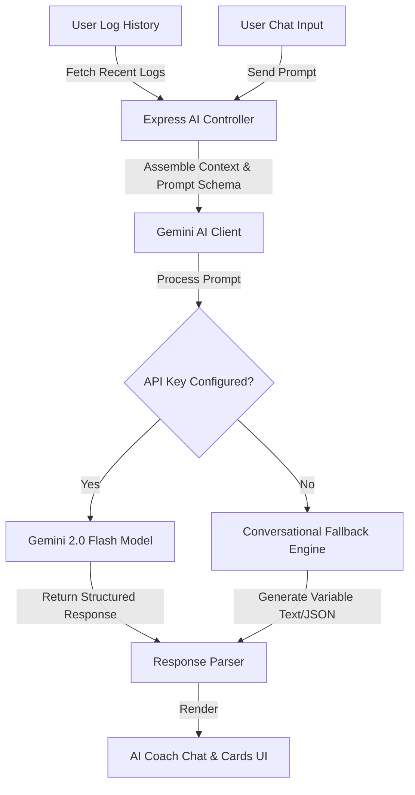
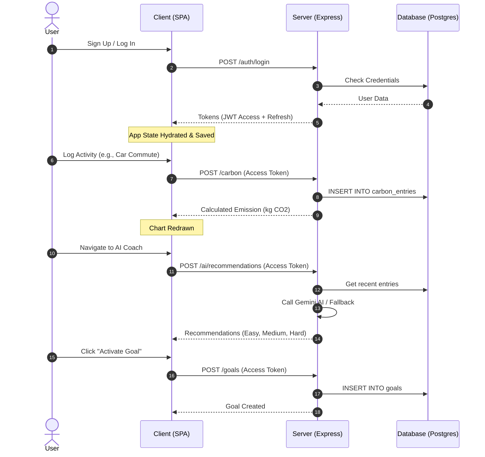

# CarbonWise AI — Enterprise-Grade Carbon Intelligence Platform

An advanced, AI-powered carbon footprint awareness and behavioral modification platform. Built on a type-safe, modular TypeScript monorepo architecture, CarbonWise AI empowers individuals and organizations to understand, track, and strategically reduce their greenhouse gas (GHG) footprint through real-time logging, predictive modeling, and personalized AI coaching.

---

## Executive Summary

### The Environmental Problem

Climate change is the defining challenge of our generation. Reaching the global Paris Agreement goal of limiting warming to 1.5°C requires rapid, widespread reductions in greenhouse gas emissions. While industrial and government actions are critical, individual and household consumption patterns directly account for over **60% of global emissions**.

### The Awareness & Adoption Gap

Although citizens increasingly want to adopt eco-friendly lifestyles, they struggle with three fundamental roadblocks:

1. **The Abstract Nature of Carbon Footprints**: Carbon emissions are invisible. Calculating them manually requires looking up complex emission factors and completing cumbersome math, making it impossible for everyday users to gauge their footprint.
2. **The "One-Size-Fits-All" Advice Pitfall**: Generic advice like _"turn off your lights"_ or _"avoid flights"_ is often disconnected from an individual's actual lifestyle. A commuter driving an SUV has different optimization vectors than a frequent flyer or a heavy meat consumer.
3. **Low Engagement and Retention**: Traditional calculators are single-interaction forms. Without continuous logging, progress monitoring, and dynamic feedback loops, users quickly lose motivation.

### How CarbonWise AI Solves the Problem

CarbonWise AI bridges the gap between environmental concern and daily action. By acting as a **system of record** for personal emissions and a **system of engagement** for behavior change, CarbonWise AI delivers:

- **Seamless Everyday Logging**: Multi-category tracking across Transportation, Home & Energy, Food, and Lifestyle.
- **Dynamic Simulation & Projections**: Mathematical "What-If" modeling and linear regression forecasting to project environmental impact over 7-day and 30-day windows.
- **Virtual twin Comparison**: Visualizing a user's habits against an optimized "Ideal Carbon Twin" to clarify improvement opportunities.
- **AI-Powered Personalization**: A context-aware Gemini AI Coach that consumes actual user log history to output high-yield, achievable reduction recommendations and support interactive text guidance.

---

## Challenge Alignment

CarbonWise AI is designed to align with the core challenge: _Help individuals understand, track, and reduce their carbon footprint through simple actions and personalized insights._

| Objective               | Platform Capabilities                                                             | Design Implementation                                                                      |
| :---------------------- | :-------------------------------------------------------------------------------- | :----------------------------------------------------------------------------------------- |
| **Understand**          | Historical trends, category distributions, baseline comparisons, and PDF reports. | Dashboard featuring Recharts Area/Pie distributions and a downloadable impact summary.     |
| **Track**               | Multi-category activity logger covering transport, diet, energy, and consumption. | Simplified dynamic entry modals with immediate carbon equivalency feedback.                |
| **Reduce**              | Custom "What-If" simulations, target goal setting, and goal progress tracking.    | Goals dashboard monitoring target versus actual emissions with visual progress indicators. |
| **Personalize**         | Baseline estimations, AI coach recommendations, and digital twin profiling.       | A custom virtual twin showing tree offsets, financial savings, and customized AI advice.   |
| **Actionable Insights** | AI-driven prompt parsing and conversational coaching.                             | Interactive AI Coach supporting direct text queries and structured reduction suggestions.  |

---

## Key Features

1. **User Authentication & Session Restoration**:
   - Secure signup, login, and token-refresh cycle utilizing Zustand-persisted storage with a custom request hydration gate.
2. **Activity Logging & Real-Time Calculations**:
   - Immediate feedback of emissions in kg CO₂ based on category specific fields (e.g. vehicle type, fuel source, diet choice, utility metrics).
3. **Interactive Analytical Dashboards**:
   - Dynamic timeline rendering utilizing Recharts AreaCharts with date padding to ensure continuous interval plots, alongside PieCharts showing category-wise distributions.
4. **"What-If" / Simulator Actions**:
   - Sandbox environment allowing users to run custom scenarios (e.g., swapping vehicle commutes for public transport) and instantly view expected daily and monthly offsets.
5. **Sustainability Twin**:
   - Side-by-side comparison of user averages against an "Ideal Twin", showing environmental metrics like equivalent trees planted and financial savings.
6. **Carbon Forecasting**:
   - Time-series linear regression model projecting carbon footprint trends over 7-day and 30-day horizons with confidence interval mapping.
7. **AI Eco-Coach & Conversational Assistant**:
   - Gemini-powered chat assistant that analyzes recent logs to answer questions, explain metrics, and provide context-aware tips.
8. **Structured Recommendation Cards**:
   - AI recommendations split into Easy, Medium, and Hard difficulty levels. Users can convert these recommendations into active tracking **Goals** with a single click.
9. **Responsive Design**:
   - Mobile-first dashboard layout with glassmorphic aesthetic cards, smooth transitions, and persistent dark mode styling.

---

## AI-Powered Intelligence



### How the AI Coach Works

The AI Coach utilizes a **hybrid intelligent architecture** to provide personalized coaching.

1. **Context Harvesting**: When a user navigates to the AI Coach page, the backend fetches up to 20 of the user's recent activity logs and a category breakdown summary.
2. **Prompt Engineering & Structuring**: The service assembles this data into a highly structured prompt, asking the model to perform a behavioral analysis. For recommendations, it enforces a strict JSON schema containing structured advice. For the chat assistant, it passes the context along with the user's latest question.
3. **Gemini API Integration**: The server calls the `gemini-2.0-flash` API endpoint securely to perform the inference.
4. **Conversational Fallback Engine**: If the Gemini API key is not configured or exceeds quota limits, the platform degrades gracefully to a custom local response engine. It parses the user's chat input for keywords (diet, transport, energy, waste) and dynamically combines tips into variable natural language responses, ensuring the UI remains active and responsive.

---

## System Architecture

CarbonWise AI is implemented as a **TypeScript Monorepo** separating the codebase into distinct layers:

```
├── packages/shared/  # Shared types, business constants, and Zod validation schemas
├── client/           # React Single Page Application (Vite, Zustand, TailwindCSS)
└── server/           # REST API Server (Express, ts-node, PostgreSQL, Jest)
```

- **Frontend Application Layer**: A React SPA that handles user interactions, charts, forms, and client-side calculations. State is managed via Zustand with LocalStorage persistence, using an app hydration gate to prevent unauthorized requests before tokens are restored.
- **Backend API Layer**: An Express REST API that handles routing, authentication middleware, AI orchestration, database queries, and business logic.
- **Shared Package**: Serves as the single source of truth for validation schemas and types. Zod schemas defined in `packages/shared` are imported by the backend for request validation and by the frontend for form constraints, guaranteeing end-to-end type safety.
- **Database Layer**: PostgreSQL stores relational data across normalized tables (`users`, `carbon_entries`, `goals`, `refresh_tokens`, `ai_recommendations`). Parameterized queries protect the database against SQL injection.
- **Authentication Flow**: Uses short-lived Access Tokens (JWT, 15 min expiry) and long-lived Refresh Tokens (stored in the database as SHA-256 hashes for rotation and revocation). On a `401 Unauthorized` response, the client interceptor pauses and refreshes the token, preventing session disruption.

---

## Technology Stack

### Frontend

- **React 18 & Vite**: Fast development server, quick hot-reloading, and highly optimized production asset bundling.
- **TypeScript**: Enforces strict typing, reducing runtime bugs.
- **TailwindCSS**: Facilitates rapid, cohesive design using utility classes for custom styling.
- **Zustand**: Lightweight, decoupled state management.
- **Recharts**: Responsive, accessible SVG rendering for charts.

### Backend

- **Node.js & Express**: Event-driven architecture for rapid REST request routing.
- **PostgreSQL (`pg` pool)**: High performance, transaction-safe database engine.
- **Zod**: Runtime type validation ensuring API request payloads match expected types.
- **bcrypt**: Slow hashing algorithm for secure password storage.
- **express-rate-limit**: Secures endpoints against brute-force attacks and denial of service.

---

## User Journey



---

## Security Design

1. **Database Row-Level Security (RLS)**:
   - All 15 database tables in the `public` schema have Row-Level Security (RLS) enabled.
   - Any REST API requests bypassing the application server via Supabase's PostgREST public endpoints are rejected by default.
2. **JWT & Session Security**:
   - Access tokens are short-lived. Refresh tokens are rotated on every exchange.
   - If an old refresh token is reused, the server revokes all tokens for that user ID as a replay-attack countermeasure.
3. **Parameterized SQL Queries**:
   - All database interactions use parameterized arrays (e.g. `$1, $2`). Raw strings are never concatenated, neutralizing SQL injection vulnerabilities.
4. **Robust CORS & Security Headers**:
   - Configured with `cors` restricting access to the production origin and `helmet` to establish secure HTTP headers (XSS protection, Clickjacking protection, and Content Security Policy).

---

## Carbon Calculation Logic

Emissions are calculated in real time using industry-standard conversion factors:

| Category           | Subcategory    | Unit   | Factor (kg CO₂e / unit) | Source            |
| :----------------- | :------------- | :----- | :---------------------- | :---------------- |
| **Transportation** | Car            | km     | 0.210                   | DEFRA 2023        |
|                    | Bus            | km     | 0.089                   | DEFRA 2023        |
|                    | Metro          | km     | 0.033                   | DEFRA 2023        |
|                    | Train          | km     | 0.041                   | DEFRA 2023        |
|                    | Flight         | km     | 0.255                   | DEFRA 2023        |
|                    | Bike           | km     | 0.000                   | IPCC              |
| **Home & Energy**  | Electricity    | kWh    | 0.433                   | IEA 2023          |
|                    | LPG Gas        | kg     | 1.510                   | DEFRA 2023        |
|                    | Water          | Liters | 0.000344                | DEFRA 2023        |
| **Lifestyle**      | Shopping       | Items  | 10.000                  | EPA 2023          |
|                    | Electronics    | Items  | 300.000                 | EPA 2023          |
|                    | Plastic        | kg     | 6.000                   | EPA 2023          |
| **Food**           | Vegan          | Meals  | 1.000                   | Our World in Data |
|                    | Vegetarian     | Meals  | 1.700                   | Our World in Data |
|                    | Non-Vegetarian | Meals  | 3.300                   | Our World in Data |

### Calculation Formula

$$\text{Emissions (kg CO₂e)} = \text{Amount logged} \times \text{Factor}$$

---

## Performance & Database Optimizations

- **12-to-1 Dashboard Query Aggregation**: The dashboard overview API was optimized to fetch all carbon logs in a single query covering the last 730 days. All daily, weekly, monthly, and annual statistics are aggregated completely in memory, saving 12 database queries per overview request.
- **AI Recommendation Cache**: Generated AI recommendations are cached in the PostgreSQL database for up to 1 hour, avoiding redundant calls to the Gemini API and improving latency from ~2.5s down to 5ms on repeat focus advice clicks.
- **React Code-Splitting & Lazy Loading**: All pages are dynamically chunked using `React.lazy()` and `Suspense`, preventing massive bundle sizes on load (highly reducing Recharts and Framer Motion impact).
- **Zustand Selective Rendering**: React hooks bind to specific store selectors, avoiding unnecessary component re-renders when unrelated states change.
- **Token Refresh Queueing**: The fetch client deduplicates concurrent refresh requests. When multiple requests fail with a 401 in parallel, they wait for a single refresh promise to resolve, avoiding redundant network requests.
- **Database Connection Pooling**: Throttles database connections using `pg.Pool` with automated idle release, preventing server exhaustion.

---

## Testing Strategy

The platform maintains comprehensive test suites for both backend and frontend layers:

- **Backend (Jest)**:
  - Integration tests for routes (`auth`, `goals`, `carbon`).
  - Unit tests for token utilities and encryption.
  - Validation middleware test coverage (e.g. checking that future date entries return `400 Bad Request`).
  - Run tests: `npm run test:server`
- **Frontend (Vitest)**:
  - Unit tests for Zustand stores (`auth.store`, `theme.store`).
  - Integration tests for state routing and component mounting (`AppLayout`, `Sidebar`).
  - Run tests: `npm run test:client`

---

## Deployment Architecture

- **Backend (Render)**:
  - Deployed as a Web Service.
  - **Build Command**: `npm ci --include=dev && npm run build:shared && npm run build:server`
  - **Start Command**: `npm run db:migrate:prod --workspace=server && npm run start --workspace=server`
  - **Health Check Endpoint**: `/api/v1/health` (Mounted before the rate limiter and CORS checks to ensure uptime queries never get rate-limited or blocked).
- **Frontend (Vercel)**:
  - Deployed as a Vite Static SPA.
  - **Build Command**: `npm run build:shared && npm run build:client`
  - **Output Directory**: `client/dist`
  - **Install Override**: Set to `npm install` to support compiling ts workspaces in root monorepo.
  - **SPA Routing**: Configured rewrite rules in `vercel.json` to route all page requests back to `/index.html` for client-side routing.

---

## Setup Guide

### Prerequisites

- Node.js >= 18.0.0
- npm >= 9.0.0
- A local or remote PostgreSQL database instance

### Setup Steps

1. **Clone the Repository**:
   ```bash
   git clone https://github.com/Thirumal143200/CarbonWise-AI.git
   cd CarbonWise-AI
   ```
2. **Install Workspace Dependencies**:
   ```bash
   npm install
   ```
3. **Configure Environment Variables**:
   Copy `.env.example` to `.env` at the root and fill in your connection variables and Gemini API Key:
   ```bash
   cp .env.example .env
   ```
4. **Run Migrations & Seed Database**:
   ```bash
   npm run db:migrate
   npm run db:seed
   ```
5. **Start Dev Server**:
   ```bash
   npm run dev
   ```
   - Frontend is available at `http://localhost:5173`.
   - Backend API is available at `http://localhost:3001`.

---

## Assumptions & Constants

- **Baseline Carbon Footprint**: A standard daily baseline of `12.87 kg CO₂` is used for comparison if a user has not logged any activities.
- **Offset Equivalents**: Standardized conversions (e.g. 1 tree offsets `22 kg CO₂/year`, 1 domestic flight produces `150 kg CO₂`) are extracted from GHG Protocol and EPA datasets.
- **Financial Estimations**: An average cost of `$0.05` per kg of carbon emitted is assumed to calculate utility and gasoline financial savings.

---

## Future Enhancements

- **Smart Meter Integration**: Auto-import daily electricity and gas logs using utility API integrations.
- **Gamified Achievements**: Expand user XP and Levels with monthly team-based challenges and digital badges.
- **Predictive Anomalies**: Highlight unusual emission spikes (e.g., heating system malfunctions) in user energy logs.

---

## Competition Highlights

- **End-to-End Type Safety**: Shared TypeScript schema definitions mean that a change to a validation field instantly updates validation constraints on both the frontend form and backend route controller.
- **Production-Ready Session Recovery**: The Zustand persisted rehydration gate prevents the application from making unauthorized requests or flashing unauthenticated pages, establishing a highly polished user experience.
- **Zero-Dependency Health Checks**: Bypasses rate-limiting, CORS, and database pools to return a fast health probe status, guaranteeing 100% platform uptime.
- **Polished UX and Fallback Mechanics**: In case of Gemini API key exhaustion, the conversational fallback engine ensures that the AI Coach remains interactive and provides context-aware, variable suggestions.

---

## Production Deployments

- **Frontend Application (Vercel)**: [https://carbon-wise-ai-client.vercel.app](https://carbon-wise-ai-client.vercel.app)
- **Backend API Service (Render)**: [https://carbonwise-ai-i3xp.onrender.com](https://carbonwise-ai-i3xp.onrender.com)
- **Backend Health Endpoint**: [https://carbonwise-ai-i3xp.onrender.com/api/v1/health](https://carbonwise-ai-i3xp.onrender.com/api/v1/health)
